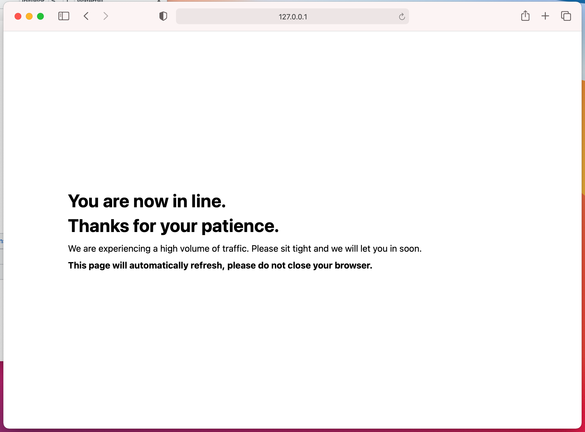
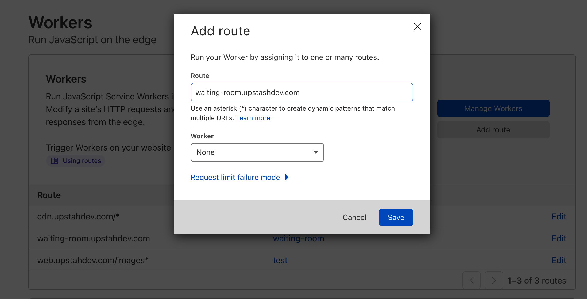

# Waiting Room with Cloudflare Workers and Upstash Redis

> [!NOTE]  
> **This project is a Community Project.**
>
> The project is maintained and supported by the community. Upstash may contribute but does not officially support or assume responsibility for it.
              
Waiting room helps you to manage peak traffic and protect your origin servers from being overwhelmed with requests. 

You can set a maximum capacity for your web site and when the capacity is full, new users are forwarded to the waiting room page. When new spots are available, waiting users are allowed to the site. It is similar to [Cloudflare Waiting Room](https://www.cloudflare.com/waiting-room/) but free and open source.

Check [the demo](https://waiting-room.upsdev.workers.dev/). For testing purposes the site's capacity is 1. When you visit the link you will see you are forwarded to the waiting room. If not, use another browser.

## How to set up?
You need Cloudflare and Upstash account. We use Cloudflare Workers to intercept the web requests and Upstash Redis to keep session information.

We will use [wrangler](https://github.com/cloudflare/wrangler) to run and deploy the Workers function. 

### Clone and configure the project
```shell
git clone git@github.com:upstash/waiting-room.git
cd waiting-room
npm install
```
           
Create an [Upstash database](https://docs.upstash.com/). Select Global database to minimize the latency. Ensure the database is completely empty as the keyspace will be used for the active sessions. 

Update the below fields in `wrangler.toml`: 

**`account_id`** Check [this guide](https://developers.cloudflare.com/workers/get-started/guide#3-configure-the-workers-cli) how to find your account id.

**`UPSTASH_REDIS_REST_URL`** Copy this from [Upstash console](https://console.upstash.com).

**`UPSTASH_REDIS_REST_TOKEN`** Copy this from [Upstash console](https://console.upstash.com).
                                                                       
**`TOTAL_ACTIVE_USERS`** This denotes the maximum capacity of your website. When the number of active sessions exceeds this number, new users are forwarded to the waiting room page.

**`SESSION_DURATION_SECONDS`** This is the seconds how long a session can stay idle. 

### Test
```shell
wrangler dev
```
You can set `TOTAL_ACTIVE_USERS` to 1 for ease of testing. Browse the page from two different browsers (e.g. Chrome then Safari), at the latest attempt, you should see the waiting room.




### Deploy
```shell
wrangler publish
```

## How to 

### Integrate with an existing site
Your domain's nameservers should point to Cloudflare. Check [here](https://developers.cloudflare.com/automatic-platform-optimization/get-started/change-nameservers). In the Workers dashboard, you need to add your domain as a route and select your Workers function.




### Customize the Waiting Room HTML
Open index.js and edit the `waiting_room_html` variable at the bottom.

### Forward all visitors to the waiting room
Set `TOTAL_ACTIVE_USERS` to 0. So all users will be forwarded to waiting room. This might be useful when you are doing some temporary maintenance. 

## TODO

- Calculate and show estimated waiting time.

- Fairness for waiting users. Current implementation randomly lets waiting users in to the site.   

..
